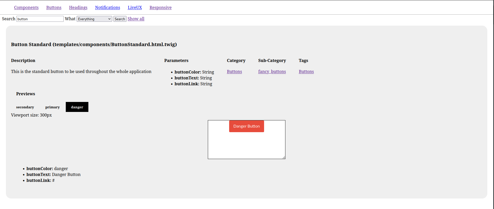

## Usage

The bundle provides two routes:

- component overview (twig_doc_home, /twig/doc): here are all components listed
- component view (twig_doc_component_view, /twig/doc/component-view): this route is used to render a component into an iframe

### Overview

This is how a component will look like on the overview page:

As the components are rendered into an iframe, you can view the behaviour of the component for different screen-sizes by simply changing its width.
